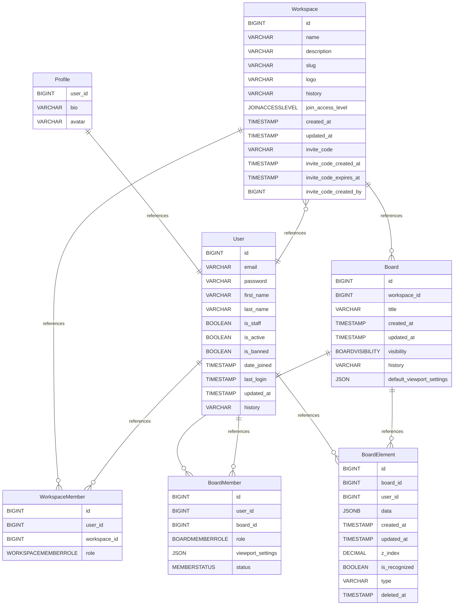

# Untitled Diagram documentation
## Summary

- [Introduction](#introduction)
- [Database Type](#database-type)
- [Table Structure](#table-structure)
	- [User](#user)
	- [Profile](#profile)
	- [Workspace](#workspace)
	- [WorkspaceMember](#workspacemember)
	- [Board](#board)
	- [BoardMember](#boardmember)
	- [BoardElement](#boardelement)
- [Relationships](#relationships)
- [Database Diagram](#database-diagram)

## Introduction

## Database type

- **Database system:** PostgreSQL
## Table structure

### User

| Name        | Type          | Settings                      | References                    | Note                           |
|-------------|---------------|-------------------------------|-------------------------------|--------------------------------|
| **id** | BIGINT | 🔑 PK, null, unique, autoincrement | fk_User_id_WorkspaceMember,fk_User_id_BoardMember,fk_User_id_BoardElement | |
| **email** | VARCHAR | not null, unique |  | |
| **password** | VARCHAR | not null |  | |
| **first_name** | VARCHAR | not null |  | |
| **last_name** | VARCHAR | not null |  | |
| **is_staff** | BOOLEAN | not null, default: false |  | |
| **is_active** | BOOLEAN | not null, default: false |  | |
| **is_banned** | BOOLEAN | not null, default: false |  | |
| **date_joined** | TIMESTAMP | not null |  | |
| **last_login** | TIMESTAMP | not null |  | |
| **updated_at** | TIMESTAMP | not null |  | |
| **history** | VARCHAR | not null |  |HistoricalRecords() | 

### Profile

| Name        | Type          | Settings                      | References                    | Note                           |
|-------------|---------------|-------------------------------|-------------------------------|--------------------------------|
| **user_id** | BIGINT | 🔑 PK, not null, unique | fk_Profile_user_id_User | |
| **bio** | VARCHAR | null |  | |
| **avatar** | VARCHAR | null |  | | 

### Workspace

| Name        | Type          | Settings                      | References                    | Note                           |
|-------------|---------------|-------------------------------|-------------------------------|--------------------------------|
| **id** | BIGINT | 🔑 PK, not null, unique, autoincrement | fk_Workspace_id_WorkspaceMember,fk_Workspace_id_Board | |
| **name** | VARCHAR | not null |  | |
| **description** | VARCHAR | not null |  | |
| **slug** | VARCHAR | not null, unique |  | |
| **logo** | VARCHAR | null |  | |
| **history** | VARCHAR | not null |  | |
| **join_access_level** | JOINACCESSLEVEL | not null, default: open |  | |
| **created_at** | TIMESTAMP | null |  | |
| **updated_at** | TIMESTAMP | null |  | |
| **invite_code** | VARCHAR | null, unique |  | |
| **invite_code_created_at** | TIMESTAMP | null |  | |
| **invite_code_expires_at** | TIMESTAMP | null |  | |
| **invite_code_created_by** | BIGINT | null | fk_Workspace_invite_code_created_by_User | | 

### WorkspaceMember

| Name        | Type          | Settings                      | References                    | Note                           |
|-------------|---------------|-------------------------------|-------------------------------|--------------------------------|
| **id** | BIGINT | 🔑 PK, not null, unique, autoincrement |  | |
| **user_id** | BIGINT | not null |  | |
| **workspace_id** | BIGINT | not null |  | |
| **role** | WORKSPACEMEMBERROLE | not null, default: member |  | | 

#### Indexes
| Name | Unique | Fields |
|------|--------|--------|
| unique_workspace_membership | ✅ | user_id, workspace_id |
### Board

| Name        | Type          | Settings                      | References                    | Note                           |
|-------------|---------------|-------------------------------|-------------------------------|--------------------------------|
| **id** | BIGINT | 🔑 PK, not null, unique, autoincrement | fk_Board_id_BoardMember,fk_Board_id_BoardElement | |
| **workspace_id** | BIGINT | not null |  | |
| **title** | VARCHAR | not null |  | |
| **created_at** | TIMESTAMP | null |  | |
| **updated_at** | TIMESTAMP | null |  | |
| **visibility** | BOARDVISIBILITY | null, default: private |  | |
| **history** | VARCHAR | not null |  |HistoricalRecords() |
| **default_viewport_settings** | JSON | null |  |When a board first time opens for a user, it’s unclear where the user should be looking (center, top-left, etc.).
A simple fix is to save the last camera position and restore it on load.
We can store this in a viewport_settings JSON on the Board (x, y, zoom). | 

### BoardMember

| Name        | Type          | Settings                      | References                    | Note                           |
|-------------|---------------|-------------------------------|-------------------------------|--------------------------------|
| **id** | BIGINT | 🔑 PK, not null, unique, autoincrement |  | |
| **user_id** | BIGINT | not null |  | |
| **board_id** | BIGINT | not null |  | |
| **role** | BOARDMEMBERROLE | not null, default: viewer |  | |
| **viewport_settings** | JSON | null |  |viewport_settings for each user |
| **status** | MEMBERSTATUS | not null, default: pending |  |'Pending = Waiting Room' | 

#### Indexes
| Name | Unique | Fields |
|------|--------|--------|
| unique_board_membership | ✅ | user_id, board_id |
### BoardElement
Undo currently works only for deletions by toggling `deleted_at`.

Changes like moving a rectangle are not undoable because state changes aren’t tracked. 

To fix this, add an action/event log (e.g., `BoardAction`) that stores the previous and next JSON state, enabling full undo/redo support.
| Name        | Type          | Settings                      | References                    | Note                           |
|-------------|---------------|-------------------------------|-------------------------------|--------------------------------|
| **id** | BIGINT | 🔑 PK, not null, unique, autoincrement |  | |
| **board_id** | BIGINT | not null |  | |
| **user_id** | BIGINT | null |  | |
| **data** | JSONB | not null |  | |
| **created_at** | TIMESTAMP | not null |  | |
| **updated_at** | TIMESTAMP | null |  | |
| **z_index** | DECIMAL | not null |  | |
| **is_recognized** | BOOLEAN | not null, default: false |  | |
| **type** | VARCHAR | not null |  |Type of the element for fast quries lockup (stroke , text , image , circle , etcs ..) |
| **deleted_at** | TIMESTAMP | null |  |(Soft Deletes) 
Real-time whiteboards rely heavily on "Undo" (Ctrl+Z). If element is physically DELETED from BoardElement, we lose the data required to undo that action immediately. | 

## Relationships

- **Workspace to WorkspaceMember**: one_to_many
- **User to WorkspaceMember**: one_to_many
- **Workspace to Board**: one_to_many
- **Board to BoardMember**: one_to_many
- **User to BoardMember**: one_to_many
- **User to BoardElement**: one_to_many
- **Profile to User**: one_to_one
- **Board to BoardElement**: one_to_many
- **Workspace to User**: many_to_one

## Database Diagram

